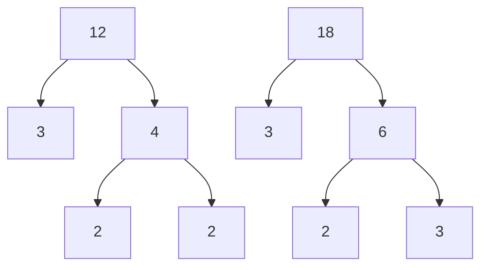

# Multiple of a number
A number is a multiple of $n$ if it is the product of a counting number and $n$
# Divisible by a number
if a number $m$ is a multiple of $n$, then $m$ is divisible by $n$.
# Divisibility Test
A number is divisible by:
- $2$ if the last digit is $0, 2, 4, 6,$ or $8$.
- $3$ if the sum of the digits is divisible by $3$.
- $5$ if the last digit is $5$ or $0$.
- $6$ if it is divisible by both $2$ and $3$.
- $10$ if it ends with $0$.
# Factors
In the expression $a.b$, both $a$ and $b$ are called factors. if $a.b=m$, both $a$ and $b$ are factors of $m$.
# Prime Number and Composite Number
A prime number is a counting number greater than 1 whose only factors are 1 and the number itself. The prime numbers less than $20$ are $2$, $3$, $5$, $7$, $11$, $13$, $17$, and $19$.

A composite number is a counting number greater than $1$ that is not prime. A composite number has factors either than $1$ and itself.
# Prime Factorization
The prime factorization of a number is the product of prime numbers that equals the number. These prime numbers are called prime factors.
# Finding the prime Factorization of a Composite number
- Find two factors whose product is the given number and use these number to create two branches
- If a factor is prime, that branch is complete. Circle the prime, like a leaf on the tree.
- If a factor is not prime, write it as the product of two factors and continue the process.
- Write the composite number as the product of all the circled primes.
# Least Common Multiple
The Least common multiple (LCM) of two numbers is the smallest number that is a multiple of both numbers.

# Example
Find the LCM of $12$ and $18$ using the prime factors method.
## Solution
 ###  Write each number as product of Primes.
 

### List the primes of each number. Match primes vertically when possible.
- $12=2.3.3$ 
- $18 = 2.3.3$
----
### Bring down the number from each column
- $12 = 2 . 2 . 3$
- $18 = 2.3.3$
### Multiply the Factors
$LCM =2.2.3.3$
$LCM=36$

# Find the least common multiple using the prime factor method
- Write each number as a product of primes
- List the primes of each number. Match primes vertically when possible.
- Bring down the columns.
- Multiply the factors.
# Variable 
A variable is a letter that represents a number whose value may change.

# Constant
A constant is a number whose value always stays the same.
# Operation Symbols

![[Pasted image 20241020143500.png]]
# Equality Symbol
$a=b$ is read "$a$ is equal to $b$." The symbol "$=$" is called the equal sign.

# Inequality
$a<b$ is read "$a$ is less than $b$". $a$ is to the left of $b$ on the number line.
![[Pasted image 20241020143803.png]]

$a > b$ is read "$a$ is read greater than $b$". $a$ is to the right of $b$ on the number line.
![[Pasted image 20241020145546.png]]
The expression $a<b$ or $a>b$ can be read from left to right or right to left. 
$a<b$ is equivalent to $b>a$.
$a>b$ is equivalent to $b<a$.
# Inequality Symbols
![[Pasted image 20241020145850.png]]
# Grouping Symbols
Parentheses $()$
Brackets []
Braces { }
Absolute value | | 
# Expression
An expression is a number, a variable, or a combination of numbers and variables using operation symbols.
# Equation
An equation is two expressions connected by an equal sign.
# Exponential Notation
$a^n$ means multiply a itself, n times. The expression $a^n$ is read a to the  power.
![[Pasted image 20241020151307.png]]
# Simplify an Expression
To simplify an expression, do  all operations in the expression.
# Order of operations
1. Parenthesis and Other Grouping Symbols
2. Exponents
3. Multiplication and Division
4. Addition and Subtraction
# Evaluate an Expression
To evaluate an expression means to find the value of the expression when the variable is replaced by a given number.
# Term
A term is a constant or the product of a constant and one or more variables.
# Coefficient
The coefficient of a term is the constant that multiplies the variable in a term.
# Like Terms
Terms that are either constants or have the same variables raised to the same powers are called like terms.
# Translate an English Phrase to an Algebraic Expression
The symbols and variables we need to translate English phrases to algebraic expressions
![[Pasted image 20241020152029.png]]
