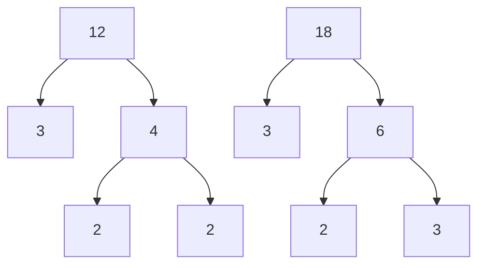

# Multiple of a number
A number is a multiple of $n$ if it is the product of a counting number and $n$
# Divisible by a number
if a number $m$ is a multiple of $n$, then $m$ is divisible by $n$.
# Divisibility Test
A number is divisible by:
- $2$ if the last digit is $0, 2, 4, 6,$ or $8$.
- $3$ if the sum of the digits is divisible by $3$.
- $5$ if the last digit is $5$ or $0$.
- $6$ if it is divisible by both $2$ and $3$.
- $10$ if it ends with $0$.
# Factors
In the expression $a.b$, both $a$ and $b$ are called factors. if $a.b=m$, both $a$ and $b$ are factors of $m$.
# Prime Number and Composite Number
A prime number is a counting number greater than 1 whose only factors are 1 and the number itself. The prime numbers less than $20$ are $2$, $3$, $5$, $7$, $11$, $13$, $17$, and $19$.

A composite number is a counting number greater than $1$ that is not prime. A composite number has factors either than $1$ and itself.
# Prime Factorization
The prime factorization of a number is the product of prime numbers that equals the number. These prime numbers are called prime factors.
# Finding the prime Factorization of a Composite number
- Find two factors whose product is the given number and use these number to create two branches
- If a factor is prime, that branch is complete. Circle the prime, like a leaf on the tree.
- If a factor is not prime, write it as the product of two factors and continue the process.
- Write the composite number as the product of all the circled primes.
# Least Common Multiple
The Least common multiple (LCM) of two numbers is the smallest number that is a multiple of both numbers.

# Example
Find the LCM of $12$ and $18$ using the prime factors method.
## Solution
 ###  Write each number as product of Primes.
 

### List the primes of each number. Match primes vertically when possible.

